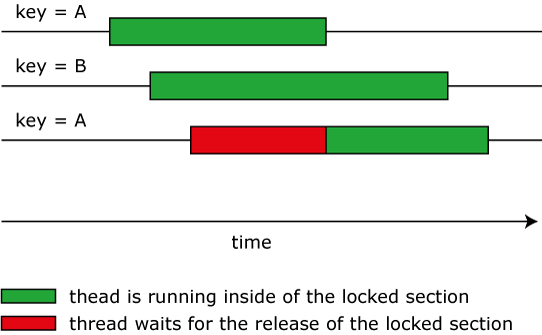

JKeyLockManager
===============

JKeyLockManager provides fine-grained locking with application specific keys.

JKeyLockManager (KLM) provides fine-grained locking with application specific keys. All resource and exception handling for the active set of keys is encapsulated in the manager. Thereby it is easier to follow the recommendation of Robert C. Martin: **"Keep your concurrency-related code separate from other code."**

### Abstract

The KLM offers the possibility of performing callbacks within a lock. It selects the lock on the basis of a given key. 
```
manager.executeLocked("test1", () -> { // run block in lock });
```
The KLM takes over the maintenance of the locks and keys completely. It can manage arbitrary quantities of keys and locks. One lock is assigned to each key and the necessary locks are produced automatically. The KLM ensures that unneeded keys and locks are being released quickly.

### Behavior with concurrency



If a thread executes a callback with a key **A**, a second thread can execute a callback with a key **B concurrently**. Another thread, which is trying to execute a callback with a key **A**, has to wait until the first thread leaves the callback.

The methods of the KLM are reentrant and interruptible.

### Example - web service with concurrency constraint

A local system exports weather data to a distributed web service. The service is called for a large set of cities and every service access for a city has a high response time. Since the service is made available on a cluster, the import can be strongly accelerated by concurrent access. The service forbids concurrent access to the weather data of the **same** city. A simple lock is used in order to ensure compliance with this constraint.

#### A simple solution with a global lock

```java
public class WeatherServiceProxy {
  public synchronized void updateWeatherData(String cityName, float temperature) {
    delegate.updateWeatherData(cityName, temperature); 
  }
}
```

#### Solution with KLM

```java
public class WeatherServiceProxy {
  private final KeyLockManager lockManager = KeyLockManagers.newManager();

  public void updateWeatherData(String cityName, float temperature) {
    lockManager.executeLocked(cityName, () -> delegate.updateWeatherData(cityName, temperature)); 
  }
```
Now threads that work on weather data from different cities can enter the locked section concurrently. Compliance with the constraint **and** speedup has been achieved.

### Getting started

#### Maven

Java 8

```
<dependency>
  <groupId>de.jkeylockmanager</groupId>
  <artifactId>jkeylockmanager</artifactId>
  <version>2.0.0</version>
</dependency>
```

Java 5, 6, 7
```
<dependency>
  <groupId>de.jkeylockmanager</groupId>
  <artifactId>jkeylockmanager</artifactId>
  <version>1.1.0</version>
</dependency>
```

#### Source

Start with `KeyLockManagers` in order to get instances of KLM.

### Versions

#### Version 2.0.0

Use of Java 8

#### Version 1.1.0

Simplified exception handling.

Execution exceptions inside of callbacks are no longer wrapped. Callbacks now have to wrap checked exceptions in unchecked exceptions.

#### Version 1.0.1

Transition to maven central

## Build Status

Master

[](https://travis-ci.org/mojgh/JKeyLockManager)

1.1 Branch

[](https://travis-ci.org/mojgh/JKeyLockManager)
